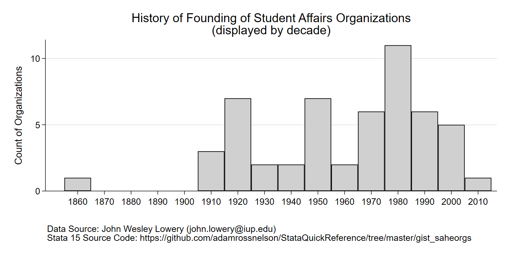

# HistogramAsTimeline.do

This routine provides an example of using histograms as a timeline. Produces a version of the following image:
 



## To run from Stata:

```Stata
do https://raw.githubusercontent.com/adamrossnelson/StataQuickReference/master/gist_saheorgs/HistogramAsTimeline.dp
```
