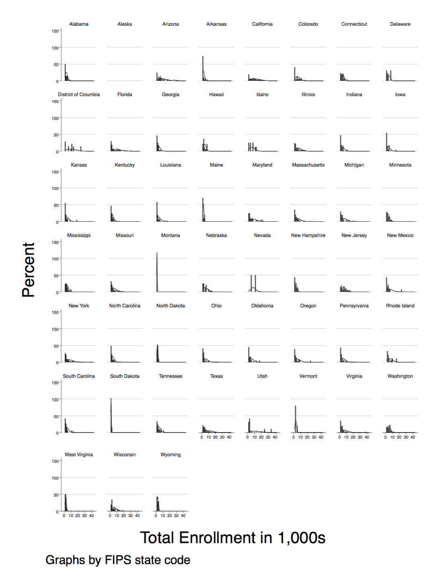
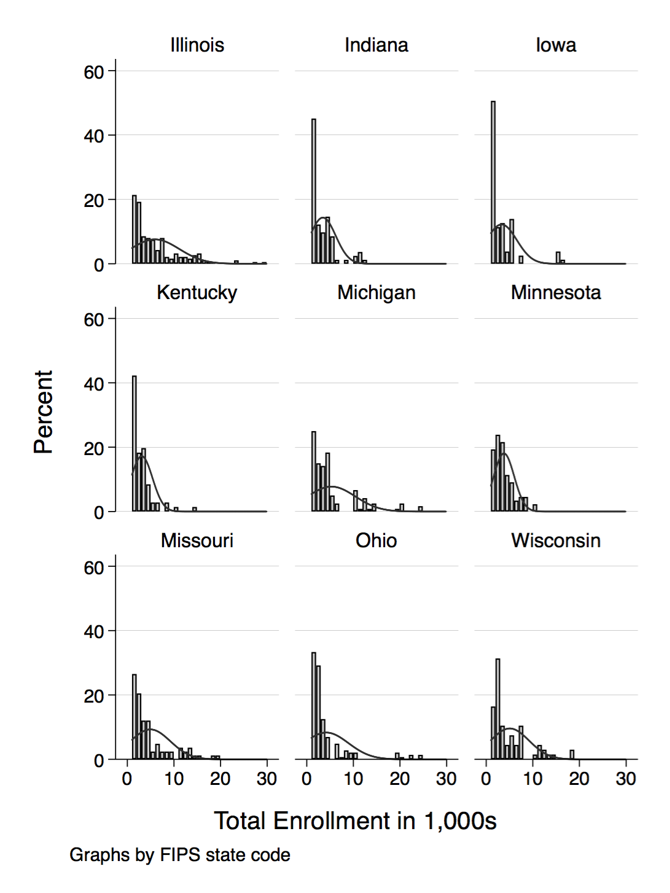
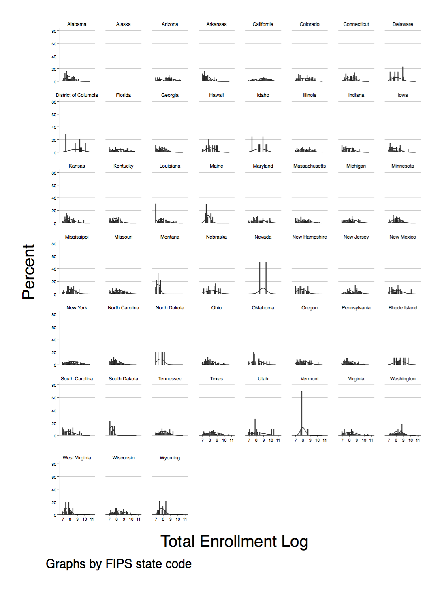
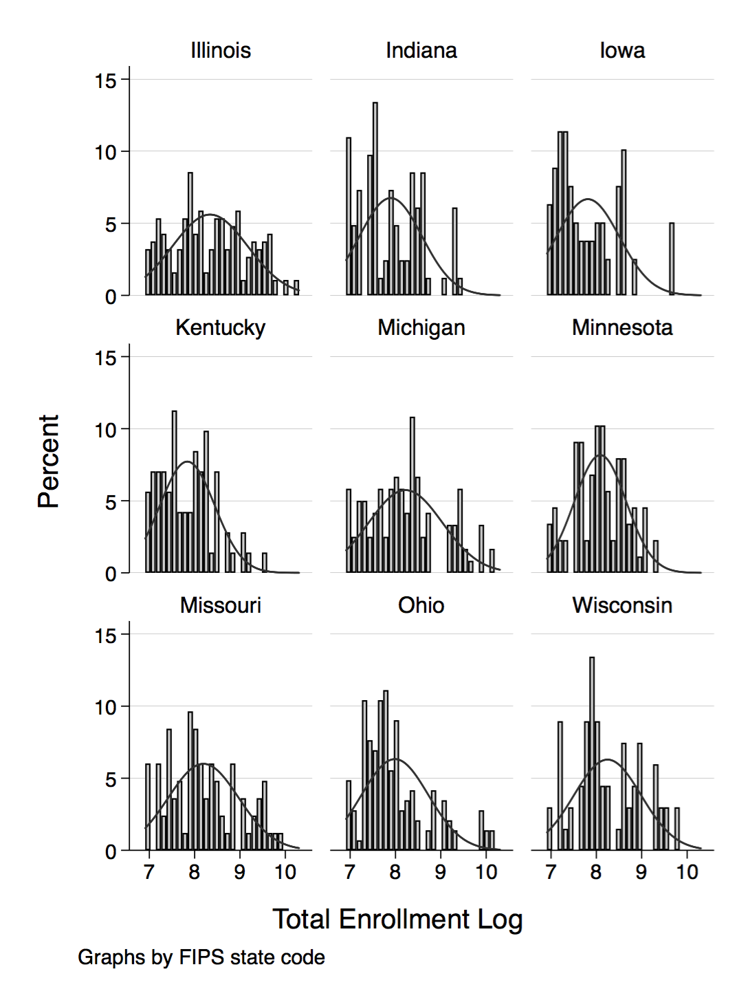

# Histogram Demonstration

Using the data file produced from: https://github.com/adamrossnelson/StataIPEDSAll/blob/master/IPEDSDirInfo02to16.do

Do file located here: https://github.com/adamrossnelson/StataQuickReference/blob/master/plotting/hgram/HistDemo.do

## Setup

```Stata
// Stata do file
// Demonstration of histograms
// April 2018 by Adam Ross Nelson
// https://github.com/adamrossnelson

// Reset the workspace
set more off
clear all

// Load data IPEDSDirInfo02to16.dta. Using the data file produced from:
// https://github.com/adamrossnelson/StataIPEDSAll/blob/master/IPEDSDirInfo02to16.do
use IPEDSDirInfo02to16.dta

// Scale and/or transform data.
clonevar s_enrtot = enrtot
replace s_enrtot = s_enrtot / 1000
label variable s_enrtot "Total Enrollment in 1,000s"
gen l_enrtot = log(enrtot)
label variable l_enrtot "Total Enrollment Log"
```

## Loop to interate over geography and data type

Each iteration produces two visualizations.

```Stata
foreach varname in s_enrtot l_enrtot {
	
	// Save variable lable for x-asis title.
	local x_title : variable label `varname'

	// Histogram of all U.S. States
	histogram `varname' if inlist(sector, 2, 4) & enrtot > 999 & fips < 60, ///
	percent name("`varname'_alsts", replace) xsize(7.5) ysize(10) by(fips) ///
	xtitle("`x_title'") normal by(, legend(off))
	
	graph export "`varname'_alsts.png", replace

	// Histogram of select Midwest U.S. States
	histogram `varname' if inlist(sector, 2, 4) & enrtot > 999 & fips < 60 & ///
	inlist(stabbr, "WI", "MN", "IA", "IL", "IN", "MI", "MO", "KY", "OH"), ///
	percent name("`varname'_mwsts", replace) xsize(7.5) ysize(10) by(fips) ///
	xtitle("`x_title'") normal by(, legend(off))

	graph export "`varname'_mwsts.png", replace

}
```
# Visualizations

## First iteration / First image



## First iteration / Second image



## Second iteration / First image



## Second iteration / Second image


