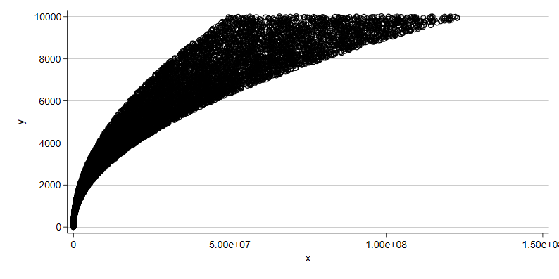

# GitHub flavored markdown genderated from Stata
This markdown file was generated from Stata. To demonstrate and
test Stata's ability to automate output for display on GitHub.
Begin by generating random numbers with a relationship. See 
original do file `md_demo.do` for demonstrated implementation.
Because routine generates dynamic image, must download do file 
to demonstrate locally.
```
set obs 10000
gen y = _n + rnormal(10.10)
gen x = runiform(.5,1.24) * _n * _n
```
## Regression Results
```
 

Linear regression                               Number of obs     =     10,000
                                                F(1, 9998)        =   26619.22
                                                Prob > F          =     0.0000
                                                R-squared         =     0.8235
                                                Root MSE          =     1212.8

------------------------------------------------------------------------------
             |               Robust
           y |      Coef.   Std. Err.      t    P>|t|     [95% Conf. Interval]
-------------+----------------------------------------------------------------
           x |   .0000943   5.78e-07   163.15   0.000     .0000932    .0000955
       _cons |   2263.404   18.23019   124.16   0.000     2227.669    2299.139
------------------------------------------------------------------------------
regress y x, r
 
```
```
 

Linear regression                               Number of obs     =     10,000
                                                F(0, 9998)        =          .
                                                Prob > F          =          .
                                                R-squared         =     0.5587
                                                Root MSE          =     1917.9

------------------------------------------------------------------------------
             |               Robust
           y |      Coef.   Std. Err.      t    P>|t|     [95% Conf. Interval]
-------------+----------------------------------------------------------------
     c.x#c.x |   8.64e-13   1.10e-14    78.36   0.000     8.42e-13    8.85e-13
             |
       _cons |   3612.435   24.21719   149.17   0.000     3564.965    3659.906
------------------------------------------------------------------------------
regress y c.x#c.x, r
 
```
## Provide Graphic

## Call another do file
```

. quietly{
 
        P R P A R E D    B Y . . .
       ___  __   ___  ____    __  __   __  __    _    __      __  __   _
      /__/ /  / /__/ / / /   /_/ /  / /_  /_    // / /_  /   /_  /  / // /
 Dr. /  / /__/ /  / / / /   / \ /__/ __/ __/   //_/ /_  /__ __/ /__/ //_/
 Twitter: @adamrossnelson                                     J.D. Ph.D.
 

. 
end of do-file
```
## Conclusion
That'll be the end of the demonstration.
